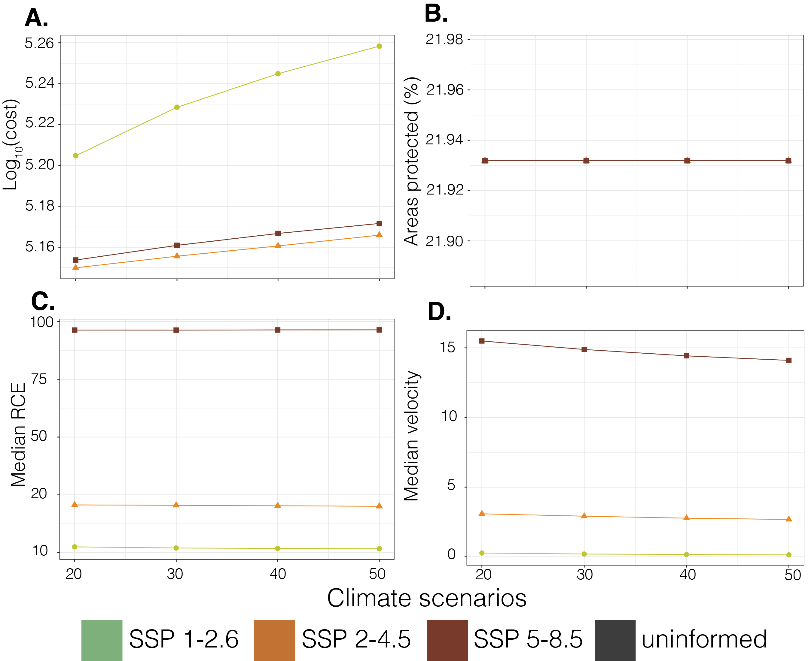
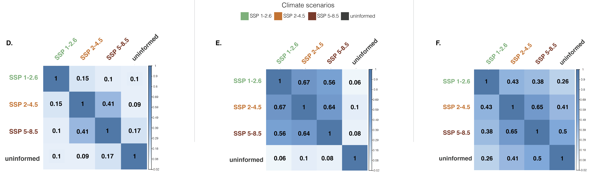
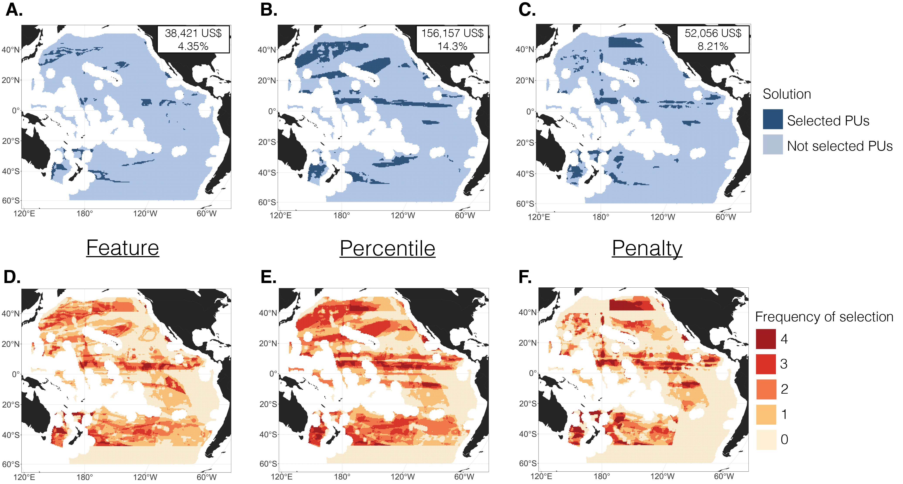

```{r, setup, include=FALSE}
knitr::opts_knit$set(root.dir = "~/GitHub/ClimateSmart/rmd/")
```

## Parameters used to run prioritizr:

### Planning region

Planning region is the entire Pacific ABNJ.

```{r echo=FALSE, out.width="80%", fig.cap="Planning region", fig.align = "center"}
knitr::include_graphics("images/PacificABNJGrid_05deg.png")
```

Thoughts:

* Not sure if the Pacific ABNJ may be the best study area for this paper. Might be good to rethink --maybe use a smaller area?

### Pelagic fisheries conservation features

There are a total of four large pelagic species' spawning grounds and five marine turtle bycatch distributions used.

```{r echo=FALSE, out.width="40%", fig.cap="Summary of Spawning Ground layers", fig.align = "center"}
knitr::include_graphics("images/PacificCommercial_Mercer_richness.png")
```
```{r echo=FALSE, out.width="40%", fig.cap="Summary of Spawning Ground layers", fig.align = "center"}
knitr::include_graphics("images/PacificTurtles_IUCN_richness.png")
```

Thoughts:

* I should increase number of conservation features. Maybe use more species from the IUCN database or simply change to AquaMaps
* If using AquaMaps: maybe rethink representation targets (uniform or inverse area-basaed)?

### Climate-smart features

We used RCE and climate velocity as climate metrics, computed under three different climate scenarios (SSP 1-2.6, SSP 2-4.5, and SSP 5-8.5). The projected temperatures forced under these three climate scenarios were from a multi-model ensemble (11 General Circulation Models). 

RCE was calculated as follows:

$$
RCE = \frac{\Delta ^{\circ}C {\hspace{2mm}} 
{\text (absolute {\hspace{2mm}} change {\hspace{2mm}}2050-2100)}}
{\Delta ^{\circ}C {\hspace{2mm}}
{\text (seasonal {\hspace{2mm}} range {\hspace{2mm}}2015-2020)}}
$$ 

```{r echo=FALSE, out.width="80%", fig.cap="RCE", fig.align = "center"}
knitr::include_graphics("images/RCE.pdf")
```

\newpage
Climate velocity was calculated as follows:

$$
{\text Climate {\hspace{2mm}} velocity} = \frac{\Delta ^{\circ}C {\hspace{2mm}} yr^{-1}
{\text (2050-2100)}}
{\Delta ^{\circ}C {\hspace{2mm}} km^{-1}
{\text (2050-2100)}}
$$

```{r echo=FALSE, out.width="80%", fig.cap="Climate Velocity", fig.align = "center"}
knitr::include_graphics("images/ClimateVelo.pdf")
```

Thoughts:

* If we're using 2015-2020 as the denominator for RCE (seasonal range), then shouldn't the others used to calculated both RCE and velocity be changed to 2015/2020 - 2100 instead of 2050-2100?
* Might be good to calculate 'exposure' for pH and oxygen (absolute changes 2020 (current) to 2100)
* Maybe have runs that use RCE alone and runs that use velocity alone

\newpage

### Cost layer

We only used large and medium pelagics for the computation of the cost layer. Cost layer was from Watson (2017) and Tai et al. (2017) using the 2006-2015 catch data. We also smoothened out the cost layer.

Cost layer was calculated as:

$$
{\text Cost {\hspace{2mm}} layer(USD)} = {\text total {\hspace{2mm}} catch (kg) {\hspace{2mm}}} 
\centerdot {\hspace{2mm}}
{\text ex-vessel {\hspace{2mm}} price (USD {\hspace{2mm}}kg^{-1})}
$$
```{r echo=FALSE, out.width="80%", fig.cap="Cost layer", fig.align = "center"}
knitr::include_graphics("images/CostLayer_LargexMedium.pdf")
```

Thoughts:

* I think we should increase scope and generalize by adding all the species available for the cost layer.
* Maybe tweak how cost was calculated/defined? Not sure on how to do this, but if there's a way to possibly incorporate fishing effort from Global Fishing Watch?

\newpage

# Different analyses done:

## Climate-uninformed and climate-smart approaches: Overview

Each of the four different approaches listed below were run with varying targets from 5 to 25% (in increments of 2.5%).

1. Climate-uninformed
- used no climate-smart metrics
2. "Feature"
- incorporated climate-smart metrics as features, with targets set similar to conservation features
3. "Percentile"
- incorporated climate-smart metrics as features but only if they intersected with conservation features
- prioritized protection of areas of slowest velocity and lowest RCE (defined as 25th percentile)
4. "Penalty"
- velocity and RCE were treated as penalties, where areas of higher velocity and RCE were penalized for being selected

### Climate-smart approach: Feature

Climate velocity and RCE were treated as conservation features. Conservation feature layers were created by selecting areas of slowest velocity and RCE (areas of velocity/RCE within their first quartiles). Then, targets were assigned to velocity and RCE. 

Conservation features (apart from velocity and RCE) had uniform targets (i.e. each run had a uniform target from 5 to 25%). To know the targets for velocity and RCE for the *Feature Approach*, the following equation was used:

$$
{\text Effective {\hspace {2mm}} target {\hspace {2mm}}}(\%) = 0.25\times{\text Representation {\hspace {2mm}} target}
$$

where ${\text Effective {\hspace {2mm}} target}$ represents the actual targets for each feature (5-25%) similar to the targets of the conservation features for that specific run, and the ${\text Representation {\hspace {2mm}} target}$ represents the value that will be inputted as "target" for each of the climate-smart features (RCE and velocity) in `prioritizr`.

For example, if the targets used for the spawning areas for this particular run is 25%, then the target assigned to velocity and RCE in this run was 100%.

### Climate-smart approach: Percentile

The areas of the slowest climate velocity and lowest RCE were defined as areas that had velocity and/or RCE within their first quartiles (25th percentile) and intersected with conservation features.

The actual targets for the conservation features using the *Percentile Approach* were assigned using the equation:

$$
{\text Effective {\hspace {2mm}} target {\hspace {2mm}}}(\%) = 0.25\times{\text Representation {\hspace {2mm}} target}
$$

where ${\text Effective {\hspace {2mm}} target}$ represents the actual targets for each feature (5-25%) and the ${\text Representation {\hspace {2mm}} target}$ represents the value that will be inputted as "target" for each of the features in `prioritizr`.

For example, to have an effective target of 25% (comparable to Feature and Penalty approaches), the target inputted into `prioritzr` was 100%.

Thoughts:

* What happens when percentiles are changed too? Instead of just using 25th percentile, like in Nur's paper, maybe explore other percentiles (e.g. 5 - 35th percentiles, increments of 5?)

\newpage

### Climate-smart approach: Penalty

Penalties for each run were calculated as follows:

$$
Penalty = \sum_{i = 1}^{I}P \times D_i \times X_i
$$
where $P$ represents the *penalty scaling*, $D_i$ represents penalty data (RCE / velocity values) for each planning unit $i$, and $X_i$ represents the decision variable (1 - selected planning unit $i$/0 - not selected planning unit $i$).


Analyses done to determine **penalty scaling** (and other important details):

* Climate velocity and RCE were treated as independent penalties
* Each climate metric was scaled to 30% of the cost (penalty scaling) (e.g. scaled the range of velocity and RCE values forced under SSP 2-4.5 to 30% of the cost)
* But different scaling were also explored (20, 30, 40, 50%),
* The magnitudes of resulting cost increased with increasing scaling factor (for each climate scenario)
* The magnitudes of RCE remained constant with increasing scaling factor
* The magnitudes of velocity decreased with increasing scaling factor
* Total area ($km^{2}$) selected for protection remained the same

```{r echo=FALSE, out.width="60%", fig.cap="Summaries of sensitivity analyses. A. Total cost. B. Total area selected for protection. C. Median RCE. D. Median velocity.", fig.align = "center"}

```

\newpage
# Post-prioritizr analyses

## Cohen's Kappa Correlation

Cohen's Kappa was used to show degrees of agreeability between spatial plans created under different climate scenarios **but** under the same approach.

```{r echo=FALSE, out.width="80%", fig.cap="Correlation matrices. D. Feature approach. E. Percentile approach. F. Penalty approach", fig.align = "center"}

```

Thoughts:

* Also cross-compare different approaches using Cohen's Kappa
* Like in Nur's paper, use Kruskal-Wallis to compare area, cost, median velocity, and median RCE between approaches and within approaches as well?
* Possibly just focusing the discussion on the resulting spatial plans forced under the same climate scenario (e.g. SSP 5-8.5)?

\newpage

## "No-regret" spatial plans

"No-regret" spatial plans were created for each climate-smart approach. Planning units were included in the "no-regret" spatial plan if they were selected for protection in all the three climate scenarios (SSP 1-2.6, SSP 2-4.5, and SSP 5-8.5).

## Frequencies of selection

Frequencies of selection of each planning unit were also mapped out for each climate-smart approach. The minimum frequency is 0 wherein said planning unit was not selected in all climate scenarios. The maximum frequency is 4 wherein said planning unit was selected in all 4 climate scenarios (climate-uninformed, SSP 1-2.6, SSP 2-4.5, and SSP 5-8.5).

```{r echo=FALSE, out.width="80%", fig.cap="No-regret spatial plans (A-C) and Frequencies of selection (D-F).", fig.align = "center"}

```